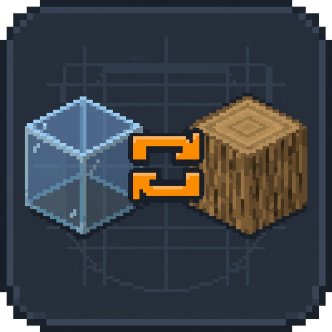
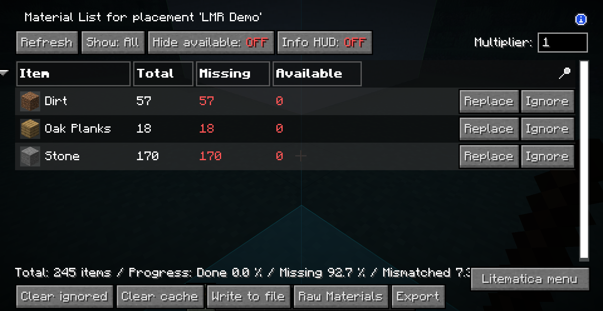
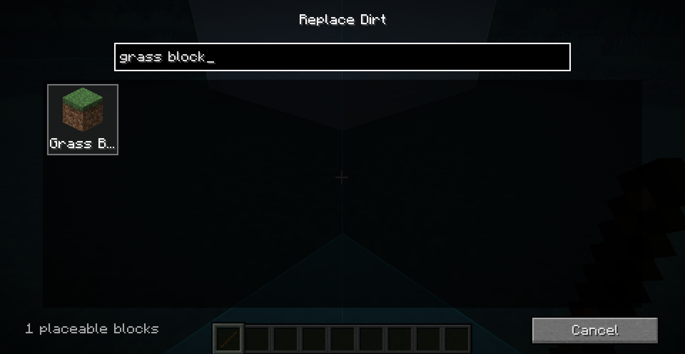

<div align="center">
  
  <h1>LMR — Litematica Material Replace</h1>
  <p><strong>Replace one material everywhere in a Litematica schematic—in a few clicks.</strong></p>
  <p>
    <a href="https://fabricmc.net/use/installer/"></a>
    
    <a href="LICENSE"></a>
  </p>
</div>

| 🔁 Replace everywhere | 🔎 Find blocks fast | 💾 Save your way |
| --- | --- | --- |
| Changes the actual schematic block data. | Search by block name or ID. | Queue several replacements, then save once. |

## See it in action

### 1. Choose a material

Every material row gets a Litematica-styled **Replace** button.



### 2. Find the replacement

Type a name or namespaced ID and choose from rendered block previews.



## Install

1. Install [Fabric Loader](https://fabricmc.net/use/installer/).
2. Download [Litematica](https://modrinth.com/mod/litematica) and
   [MaLiLib](https://modrinth.com/mod/malilib) for your exact Minecraft version.
3. Download the matching LMR jar from
   [Modrinth](https://modrinth.com/mod/litematicamatreplace-lmr)
   and place all three mods in your `mods` folder.

> **Supported:** Minecraft `26.1`, `26.1.1`, `26.1.2`, and `26.2` on Fabric.
> LMR is client-side and does not bundle Litematica or MaLiLib.

## Use

1. Open a schematic or placement **Material List**.
2. Click **Replace** beside the material you want to change.
3. Search for and select the new block, then add the change to the queue.
4. Choose **Replace Another** until all wanted materials are queued.
5. Choose **Save Changes**, then **Overwrite Original** or **Export as New**.

> **Tip:** Export as new if you want to keep the original schematic untouched.
> Replacements use the target block's default state; NBT and orientation are
> not preserved.

<details>
<summary><strong>Build from source</strong></summary>

Requires Java 25.

```powershell
.\gradlew.bat :26.1:build :26.1.1:build :26.1.2:build :26.2:build
```

Jars are written to each target's `versions/<minecraft>/build/libs/` folder.
The build produces distributable jars only—no source jars.

</details>

---

GPL-3.0-only · © 2026
[NullKeeper-dev](https://github.com/NullKeeper-dev)
